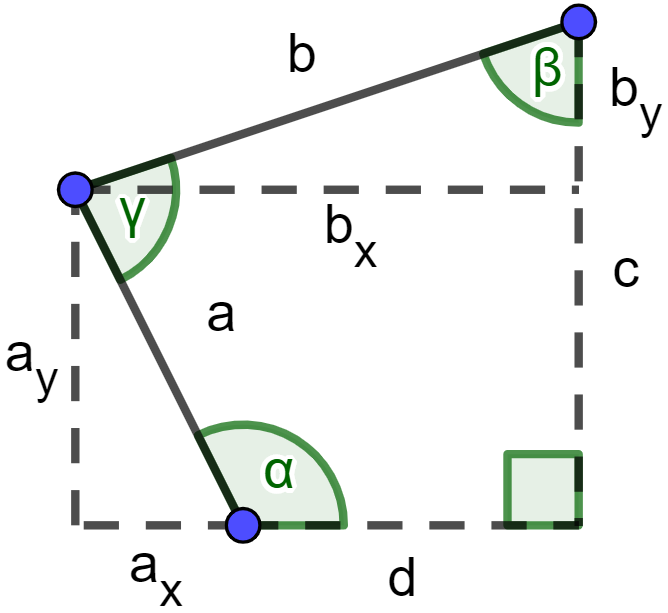
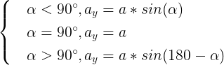

# LewanSoul robotic xArm

Using robotic arm with 6 servos is hard to control. All angle calculations must be done in mind, and applied using controller. It can be solved with some math functions. Bellow is provided math behind moving arm up or down in two axis mode.

# Arm structure

  

 

From side robotic arm can be seen as in image. Moving arm up or down, closer or further requires calculating angles of servos. What can be done is calculate angles based on it's current position and delta shift in vertical and horizontal axes. Its enougth to use for calculations ABCD quadrilateral since some angles and sides are known, also it is know what position shift. Calculations use formulas: [law of cosines](https://en.wikipedia.org/wiki/Law_of_cosines), [Pythagorean theorem](https://en.wikipedia.org/wiki/Pythagorean_theorem), [trigonometric identities](https://en.wikipedia.org/wiki/List_of_trigonometric_identities)

# Calculations

  

 

Image displays initial arm position. At this poin known are sides a and b, also angles α and γ angles.

  

 

Since:

  

 

Then:

  

 

Since:

  

And:
 

  

 

  

 

Then:

  

 

  

 
